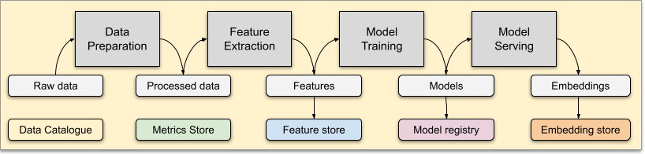

# Mastro

    

        

            
        

        
Metadata management in Go 

    

## Data What?

## Goals
Managing Metadata to achieve:
- Versioning - annotate with version information
- Lineage - understanding data dependencies
- Quality - enrich data with dependability information
- Democratization - foster self-service culture

Modeling of the data transformation layer to foster:
- Discovery - of data assets across heterogeneous communities
- Reuse - of domain specific knowledge and pre-computed features in different use cases
- Enforcing - of established industry or domain-specific transformations and practices
- Interaction - between different roles through teams and projects

## Disclaimer

Mastro is still on development and largely untested. Please fork the repo and extend it at wish.

## TL-DR

Terminology:
* [Connector](commons/CONNECTORS.md) - component handling the connection to volumes and data bases
* [FeatureStore](featurestore/README.md) - service to manage features (i.e., featureSets);
* [MetricStore](metricstore/README.md) - service to manage metrics (i.e., metricSets);
* [Catalogue](catalogue/README.md) - service to manage data assets (i.e., static data definitions and their relationships);
* [Crawler](crawlers/README.md) - any agent able to list and walk a file system, filter and parse asset definitions (i.e. manifest files) and push them to the catalogue;
* [UI](ui/README.md) - basic user interface to search assets by name and tags
* [MVC](mvc/README.md) - data versioning tool for various storage - based on the `commons.abstract.sources` package

Help:
* [PlantUML Diagram of the repo](https://www.dumels.com/diagram/4a292159-170b-4abd-bb7a-b93a86c746a7)
* [Configuration](commons/CONFIGURATION.md)
* [Deploy to K8s](K8S-DEPLOY.md)

License:  

Build Status:

  
  
  
  
  