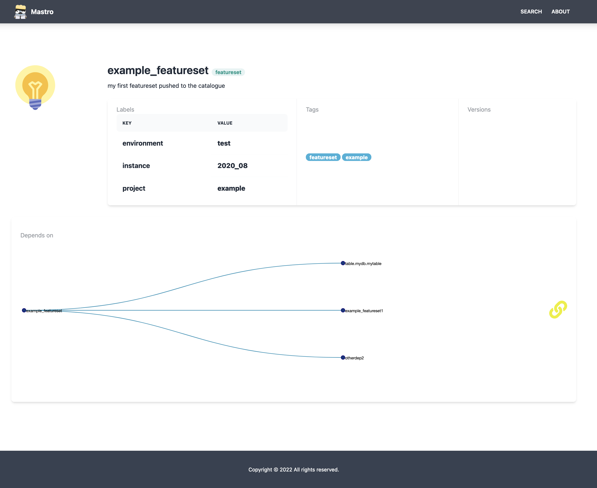

# Mastro UI
Minimal UI for the Mastro Catalogue

## Usage

- Define endpoints in `config.js` (you can mount it as config map on K8s);
- Query by: i) asset "`name`" or ii) "`#tag, ...`";

## Screenshot

